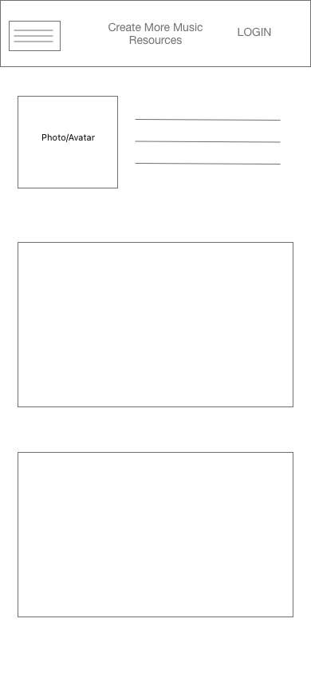
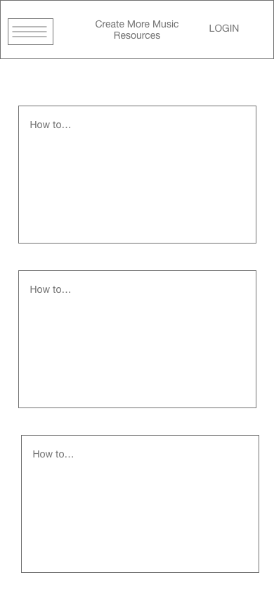
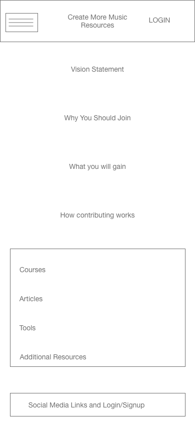
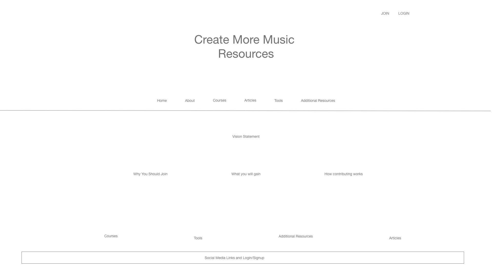

# CMMS Music Resources

### Description
This web application is built for musicians of all ages and levels to learn and advance on their instrument, as well as to educate and encourage members.  
 

### Technologies Used For Full-Stack Application
- HTML5
- CSS3
- Javascript
- Node.js
- Express
- MongoDb
 

### Technologies Used For Design
- Adobe XD
- Adobe Illustrator
 

### Wireframes

### Getting Started
 <a href="https://on-music.herokuapp.com/">Click Here</a>
to access the site!

### Future Enhancements
- Incorporate resources for more instruments
- Classroom resources by grade
- Video courses
